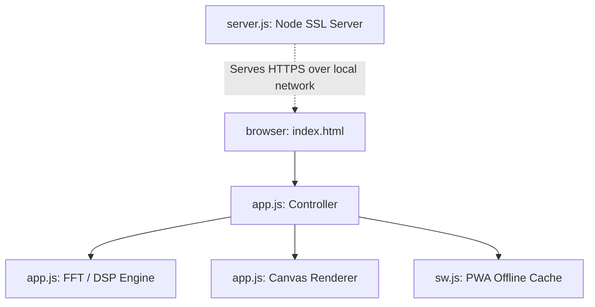

# Developer and AI Agent Handbook (AGENT.md)

Welcome! This document outlines the technical architecture, digital signal processing (DSP) implementation, code layout, and maintenance instructions for **FlickerHz**. If you are an AI assistant or human developer maintaining this codebase, use this as your reference manual.

---

## 🏗️ Architecture Overview

FlickerHz is designed as a zero-dependency, static Single Page Application (SPA) paired with a lightweight Node.js utility server.

### Key Components
1.  **Frontend Layout ([index.html](file:///home/tonym/Projects/flashy_light/index.html))**: Structure for dashboard tabs, sliders, select dropdowns, responsive grids, and standard HTML5 `<canvas>` elements for all drawings.
2.  **Styles ([styles.css](file:///home/tonym/Projects/flashy_light/styles.css))**: CSS variables, responsive layout breakpoints, mobile touch-friendly inputs, and visual effects (e.g. glassmorphism backdrop-blur filters, glows, scanner animations).
3.  **App Controller & DSP ([app.js](file:///home/tonym/Projects/flashy_light/app.js))**:
    -   Implements a Radix-2 Cooley-Tukey FFT.
    -   Averages camera rows/columns to extract raw spatial signals.
    -   Performs real-time detrending, windowing, padding, peak finding, and parabolic sub-bin frequency interpolation.
    -   Renders custom high-performance oscilloscope and spectrum graphs directly onto `<canvas>` at 60fps.
4.  **Local Dev Server ([server.js](file:///home/tonym/Projects/flashy_light/server.js))**: Uses native Node.js HTTPS and HTTP modules. Dynamically spawns `openssl` to generate local self-signed certificates. Output IP addresses to facilitate quick Wi-Fi connections from external mobile devices.
5.  **Offline Service Worker ([sw.js](file:///home/tonym/Projects/flashy_light/sw.js))**: Static caching of index.html, styles.css, app.js, manifest.json, and icon.svg for offline PWA startup.

---

## 🔢 Signal Processing & Mathematical Details

### 1. Radix-2 FFT Class
The `FFT` class implements an in-place decimation-in-time Cooley-Tukey algorithm.
-   **Size**: Fixed at $4096$ bins.
-   **Optimization**: Precomputes trigonometric tables (`cosTable` and `sinTable`) and bit-reversal permutations (`reversedIndices`) in the constructor to avoid memory allocation or trigonometric calculation during the frame loop.
-   **Memory Overhead**: GC pauses are minimized by keeping a single pre-allocated imaginary buffer `imag` and reusing it on every forward pass.

### 2. Detrending Filter
The `detrend` function applies a sliding-window high-pass filter:
$$y_{\text{detrended}}[n] = y[n] - \frac{1}{2W+1} \sum_{i=-W}^{W} y[n+i]$$
-   The window size $W$ is calculated dynamically based on the current sensor skew:
    $$W = \text{clamp}\left(16, 256, \text{round}\left(512 \times \frac{0.015}{T_{\text{skew}}}\right)\right)$$
    This ensures the high-pass filter cutoff remains roughly constant at $\approx 33\text{ Hz}$ regardless of the rolling shutter speed, preserving the $100\text{ Hz}$ and $120\text{ Hz}$ peaks while removing low-frequency spatial lighting gradients.

### 3. Sub-bin Peak Interpolation
Standard FFT frequency resolution is limited by bin width:
$$\Delta f = \frac{512}{8 \times T_{\text{skew}} \times 4096} = \frac{1}{64 \times T_{\text{skew}}}$$
At $T_{\text{skew}} = 30\text{ ms}$, $\Delta f \approx 4.16\text{ Hz}$. 
To obtain fractional bin precision, we fit a parabola to the highest bin magnitude $\beta$ and its immediate neighbors $\alpha$ (left) and $\gamma$ (right):
$$d = \frac{1}{2} \left( \frac{\alpha - \gamma}{\alpha - 2\beta + \gamma} \right)$$
$$\text{Interpolated Bin} = p + d$$
This allows the app to report frequency variations as small as $0.1\text{ Hz}$.

### 4. Dual-Axis Axis Locking
To support both portrait/landscape orientation and varying hardware layout configurations, the app extracts:
-   `rowAverages`: Vertical temporal axis (horizontal banding).
-   `colAverages`: Horizontal temporal axis (vertical banding).
It runs `analyzeSignal` on both vectors and selects the one with the higher peak-to-average SNR ratio:
$$\text{SNR} = \frac{\text{Peak Magnitude}}{\text{Average Magnitude of Search Range}}$$
If the winning SNR is below a threshold of $3.2$, the system reports "NO FLICKER DETECTED" to prevent noise display.

### 5. Driver Quality & Modulation Depth Math
To assess driver quality, we measure the **Percent Flicker** (also known as modulation depth). To avoid being distorted by slow spatial lighting gradients across the camera lens (vignetting, bulb positioning), we isolate the AC oscillation amplitude using the detrended signal and measure it relative to the local raw DC average in the center 50% region ($n \in [128, 383]$):
$$\text{Percent Flicker} = \frac{\max(d[n]) - \min(d[n])}{2 \times \text{mean}(y[n])} \times 100\%$$
Where:
- $d[n]$ is the detrended signal (representing the AC ripple).
- $y[n]$ is the raw signal (representing the combined DC + AC illumination).

We compare this calculated percentage against the **IEEE 1789-2015** standard limits:
- For $f < 90\text{ Hz}$: Low Risk = $f \times 0.025$, NOEL = $f \times 0.01$
- For $f \ge 90\text{ Hz}$: Low Risk = $f \times 0.08$, NOEL = $f \times 0.033$

**Classification Logic in `app.js`:**
-   `percentFlicker < 3.0%` or `percentFlicker <= noelLimit`: `EXCELLENT (FLICKER-FREE)` or `HIGH QUALITY (SAFE)`
-   `percentFlicker <= lowRiskLimit`: `STANDARD QUALITY (SAFE)`
-   `percentFlicker > lowRiskLimit`:
    -   If $f \in [90, 130]\text{ Hz}$: `LOW QUALITY (MODERATE AC RIPPLE)` (if $<30\%$) or `LOW QUALITY (HIGH AC RIPPLE)` (if $>30\%$). This identifies cheap drivers lacking electrolytic smoothing capacitors.
    -   If $f \in [130, 500]\text{ Hz}$: `LOW QUALITY (LOW-FREQ PWM)` (indicates cheap dimming circuitry with stroboscopic hazards).
    -   Other ranges: `LOW QUALITY (UNSTABLE)`

---

## 🛠️ Maintenance & Future Enhancements

1.  **Manual Camera Settings**: If the browser's `MediaStreamTrack.applyConstraints()` ever receives reliable manual support on Android, implement a manual slider for `exposureTime` and `iso` to automate setting a fast shutter speed (instead of instructing the user to point directly at the bulb).
2.  **Calibrated Skew Persistence**: The calibrated skew is saved to `localStorage` key `rolling_shutter_skew`. If the user clears browser data, the value resets to the default $30.0\text{ ms}$.
3.  **High FPS Cameras**: Some Android devices support capturing streams at 60fps or 120fps via WebRTC. If high-fps tracks are detected, $T_{\text{skew}}$ values might scale down, requiring recalibration.
