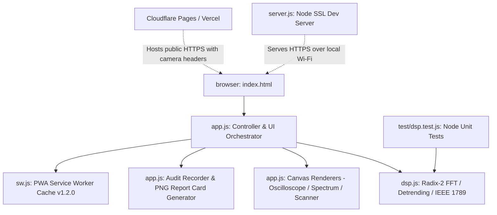

# Developer and AI Agent Handbook (AGENT.md)

Welcome! This document outlines the technical architecture, digital signal processing (DSP) implementation, code layout, and maintenance instructions for **FlickerHz**. If you are an AI assistant or human developer maintaining this codebase, use this as your reference manual.

---

## 🏗️ Architecture Overview

FlickerHz is designed as a zero-dependency, static Progressive Web Application (PWA) with client-side digital signal processing and automated unit testing.

```mermaid
graph TD
    A[browser: index.html] --> B[app.js: Controller & UI Orchestrator]
    B --> C[dsp.js: Radix-2 FFT / Detrending / IEEE 1789]
    B --> D[app.js: Canvas Renderers - Oscilloscope / Spectrum / Scanner]
    B --> E[app.js: Audit Recorder & PNG Report Card Generator]
    B --> F[sw.js: PWA Service Worker Cache v1.2.0]
    G[test/dsp.test.js: Node Unit Tests] --> C
    H[server.js: Node SSL Dev Server] -.->|Serves HTTPS over local Wi-Fi| A
    I[Cloudflare Pages / Vercel] -.->|Hosts public HTTPS with camera headers| A
```

### Key Components
1.  **Frontend Layout ([index.html](file:///home/tonym/Projects/flashy_light/index.html))**: Accessible interface containing live camera view, Exposure HUD, sensor profile badges, synthetic test signal selector, tabbed waveform/spectrum graphs, 10-second audit recording card, and calibration modal.
2.  **Styles ([styles.css](file:///home/tonym/Projects/flashy_light/styles.css))**: Mobile-first responsive styling with high-contrast HUD badges, pulsating status indicators, and glassmorphism styling.
3.  **DSP Core Engine ([dsp.js](file:///home/tonym/Projects/flashy_light/dsp.js))**:
    -   Zero-allocation Radix-2 Cooley-Tukey FFT implementation.
    -   In-place $O(n)$ sliding window detrending filter preserving 50/60/100/120Hz oscillations while stripping DC spatial illumination.
    -   Parabolic sub-bin peak interpolation ($<0.1\text{ Hz}$ resolution).
    -   Modulation depth (Percent Flicker) calculator.
    -   IEEE 1789-2015 driver hazard classification engine.
    -   Universal module export (runs identically in browser and Node.js test environment).
4.  **Application Controller ([app.js](file:///home/tonym/Projects/flashy_light/app.js))**:
    -   Zero-GC pre-allocated TypedArray scratch buffers (`colAverages`, `rowAverages`, `windowedScratch`, `realBufferScratch`).
    -   MediaTrack advanced constraints negotiator (shutter time, continuous focus lock).
    -   Synthetic signal generator for offline hardware-independent verification.
    -   Multi-camera lens profile persistence in `localStorage`.
    -   10-second rolling audit session recorder, CSV and JSON exporters, and 2D canvas PNG Report Card renderer.
5.  **Automated Unit Tests ([test/dsp.test.js](file:///home/tonym/Projects/flashy_light/test/dsp.test.js))**: Native Node test suite verifying FFT transformations, parabolic peak accuracy, filter frequency responses, and IEEE 1789 boundaries.
6.  **Production Deployment Configs ([vercel.json](file:///home/tonym/Projects/flashy_light/vercel.json), [_headers](file:///home/tonym/Projects/flashy_light/_headers), [DEPLOYMENT.md](file:///home/tonym/Projects/flashy_light/DEPLOYMENT.md))**: Ready-to-deploy configuration with `Permissions-Policy: camera=(self)` and service worker cache headers.
7.  **Local Dev Server ([server.js](file:///home/tonym/Projects/flashy_light/server.js))**: Spawns `openssl` for self-signed development certificates across local Wi-Fi.

---

## 🔢 Signal Processing & Mathematical Details

### 1. Radix-2 FFT Class
The `FFT` class implements an in-place decimation-in-time Cooley-Tukey algorithm.
-   **Size**: Fixed at $4096$ bins.
-   **Optimization**: Precomputes trigonometric tables (`cosTable` and `sinTable`) and bit-reversal permutations (`reversedIndices`) in the constructor to avoid memory allocation or trigonometric calculation during the frame loop.
-   **Memory Overhead**: GC pauses are minimized by keeping a single pre-allocated imaginary buffer `imag` and reusing it on every forward pass.

### 2. Detrending Filter
The `detrend` function applies a sliding-window high-pass filter:
$$y_{\text{detrended}}[n] = y[n] - \frac{1}{2W+1} \sum_{i=-W}^{W} y[n+i]$$
-   The window size $W$ is calculated dynamically based on the current sensor skew:
    $$W = \text{clamp}\left(16, 256, \text{round}\left(512 \times \frac{0.015}{T_{\text{skew}}}\right)\right)$$
    This ensures the high-pass filter cutoff remains roughly constant at $\approx 33\text{ Hz}$ regardless of the rolling shutter speed, preserving the $100\text{ Hz}$ and $120\text{ Hz}$ peaks while removing low-frequency spatial lighting gradients.

### 3. Sub-bin Peak Interpolation
Standard FFT frequency resolution is limited by bin width:
$$\Delta f = \frac{512}{8 \times T_{\text{skew}} \times 4096} = \frac{1}{64 \times T_{\text{skew}}}$$
At $T_{\text{skew}} = 30\text{ ms}$, $\Delta f \approx 4.16\text{ Hz}$. 
To obtain fractional bin precision, we fit a parabola to the highest bin magnitude $\beta$ and its immediate neighbors $\alpha$ (left) and $\gamma$ (right):
$$d = \frac{1}{2} \left( \frac{\alpha - \gamma}{\alpha - 2\beta + \gamma} \right)$$
$$\text{Interpolated Bin} = p + d$$
This allows the app to report frequency variations as small as $0.1\text{ Hz}$.

### 4. Dual-Axis Axis Locking
To support both portrait/landscape orientation and varying hardware layout configurations, the app extracts:
-   `rowAverages`: Vertical temporal axis (horizontal banding).
-   `colAverages`: Horizontal temporal axis (vertical banding).
It runs `analyzeSignal` on both vectors and selects the one with the higher peak-to-average SNR ratio:
$$\text{SNR} = \frac{\text{Peak Magnitude}}{\text{Average Magnitude of Search Range}}$$
If the winning SNR is below a threshold of $3.2$, the system reports "NO FLICKER DETECTED" to prevent noise display.

### 5. Driver Quality, Modulation Depth & IES Flicker Index
To assess driver quality, the app computes both **Percent Flicker** (modulation depth) and the **IES Flicker Index (RP-16-10)**:
$$\text{Percent Flicker} = \frac{\max(d[n]) - \min(d[n])}{2 \times \text{mean}(y[n])} \times 100\%$$
$$\text{Flicker Index} = \frac{\text{Area Above Mean}}{\text{Total Area Under Waveform}} = \frac{\sum_{d[n] > 0} d[n]}{\sum y[n]}$$
Where:
- $d[n]$ is the detrended signal (representing the zero-mean AC ripple).
- $y[n]$ is the raw signal (representing total optical illumination).

We compare Percent Flicker against **IEEE 1789-2015** standard limits:
- For $f < 90\text{ Hz}$: Low Risk = $f \times 0.025$, NOEL = $f \times 0.01$
- For $f \ge 90\text{ Hz}$: Low Risk = $f \times 0.08$, NOEL = $f \times 0.033$

### 6. Harmonic Analysis & Total Harmonic Distortion (THD)
To detect triac phase-cut dimmers and cheap linear non-isolated drivers, the DSP searches for harmonic overtones $H_2 \dots H_5$ ($2f_1, 3f_1, 4f_1, 5f_1$):
$$\text{THD} = \frac{\sqrt{\sum_{h=2}^5 V_h^2}}{V_1} \times 100\%$$
Pure constant-current drivers exhibit $THD < 5\%$, whereas distorted half-wave drivers produce $THD > 40\%$.

### 7. Dynamic ROI Core Tracking
To isolate the light source and prevent dark surrounding boundaries from diluting the modulation depth, the app evaluates a coarse 2D grid every frame. Pixels with luminance $Y > 0.45 \times Y_{\max}$ determine the core bounding box $[x_{\min}, x_{\max}]$ and $[y_{\min}, y_{\max}]$. The ROI bounds are smoothed using an exponential moving average ($15\%$ blend per frame) to prevent jitter.

### 8. Audit Stability Analysis & Lab Certification
During the 10-second capture, the standard deviation of estimated frequency ($\sigma_f$) and signal-to-noise ratio ($SNR$) are evaluated:
- **Class A (Lab Certified / High Precision)**: $\sigma_f < 0.25\text{ Hz}$ and $\text{SNR} \ge 7.0\text{ dB}$.
- **Class B (Field Stable)**: $\sigma_f < 0.80\text{ Hz}$ and $\text{SNR} \ge 4.0\text{ dB}$.
- **Class C (Marginal / Environmental Noise)**: $\sigma_f \ge 0.80\text{ Hz}$ or $\text{SNR} < 4.0\text{ dB}$.

---

## 🛠️ Maintenance & Future Enhancements

1.  **Manual Camera Settings**: If the browser's `MediaStreamTrack.applyConstraints()` ever receives reliable manual support on Android, implement a manual slider for `exposureTime` and `iso` to automate setting a fast shutter speed (instead of instructing the user to point directly at the bulb).
2.  **Calibrated Skew Persistence**: The calibrated skew is saved to `localStorage` key `rolling_shutter_skew`. If the user clears browser data, the value resets to the default $30.0\text{ ms}$.
3.  **High FPS Cameras**: Some Android devices support capturing streams at 60fps or 120fps via WebRTC. If high-fps tracks are detected, $T_{\text{skew}}$ values might scale down, requiring recalibration.
