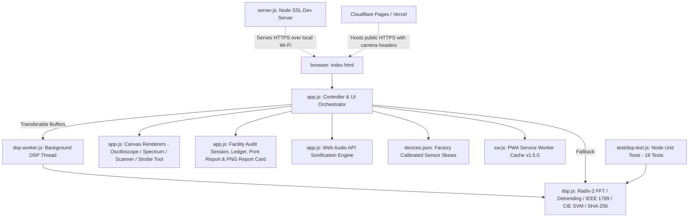

# Developer and AI Agent Handbook (AGENT.md)

Welcome! This document outlines the technical architecture, digital signal processing (DSP) implementation, code layout, and maintenance instructions for **FlickerHz**. If you are an AI assistant or human developer maintaining this codebase, use this as your reference manual.

---

## 🏗️ Architecture Overview

FlickerHz is designed as a zero-dependency, static Progressive Web Application (PWA) with client-side digital signal processing and automated unit testing.

```mermaid
graph TD
    A[browser: index.html] --> B[app.js: Controller & UI Orchestrator]
    B -->|Transferable Buffers| K[dsp.worker.js: Background DSP Thread]
    K --> C[dsp.js: Radix-2 FFT / Detrending / IEEE 1789 / CIE SVM / SHA-256]
    B -->|Fallback| C
    B --> D[app.js: Canvas Renderers - Oscilloscope / Spectrum / Scanner / Strobe Tool]
    B --> E[app.js: Facility Audit Session, Ledger, Print Report & PNG Report Card]
    B --> L[app.js: Web Audio API Sonification Engine]
    B --> F[devices.json: Factory Calibrated Sensor Skews]
    B --> G[sw.js: PWA Service Worker Cache v1.5.0]
    H[test/dsp.test.js: Node Unit Tests - 19 Tests] --> C
    I[server.js: Node SSL Dev Server] -.->|Serves HTTPS over local Wi-Fi| A
    J[Cloudflare Pages / Vercel] -.->|Hosts public HTTPS with camera headers| A
```

### Key Components
1.  **Frontend Layout ([index.html](file:///home/tonym/Projects/flashy_light/index.html))**: Accessible interface containing live camera view, Exposure HUD, Ambient Tare HUD, sensor profile badges, EU Ecodesign ($SVM$) card, synthetic test signal selector, tabbed waveform/spectrum graphs, facility audit session manager, printable compliance document view, fullscreen Screen Strobe Generator, and calibration modal.
2.  **Styles ([styles.css](file:///home/tonym/Projects/flashy_light/styles.css))**: Mobile-first responsive styling with high-contrast HUD badges, pulsating status indicators, responsive 5-column metric grid, audit ledger table, fullscreen strobe viewport, and clean A4 `@media print` compliance sheet styling.
3.  **Dedicated Web Worker ([dsp.worker.js](file:///home/tonym/Projects/flashy_light/dsp.worker.js))**: Offloads 4096-point Cooley-Tukey Radix-2 FFT, sliding-window detrending, and harmonic analysis to a separate CPU thread using transferable `ArrayBuffer`s, maintaining a rock-solid 60fps UI frame rate on mobile devices.
4.  **DSP Core Engine ([dsp.js](file:///home/tonym/Projects/flashy_light/dsp.js))**:
    -   Zero-allocation Radix-2 Cooley-Tukey FFT implementation.
    -   Photometric de-gamma linearization table (`GAMMA_22_LUT`) converting sRGB pixel values to linear physical radiance.
    -   Ambient DC baseline subtraction in modulation depth, flicker index, and SVM calculations.
    -   In-place $O(n)$ sliding window detrending filter preserving 50/60/100/120Hz oscillations while stripping DC spatial illumination.
    -   Parabolic sub-bin peak interpolation ($<0.1\text{ Hz}$ resolution).
    -   Modulation depth (Percent Flicker) and IES RP-16-10 Flicker Index calculators.
    -   Harmonic overtone analyzer and Total Harmonic Distortion ($THD$).
    -   CIE TN 006:2016 / IEC TR 63158 Stroboscopic Visibility Measure ($SVM$).
    -   Deterministic SHA-256 digital signature generator for audit records.
    -   IEEE 1789-2015 driver hazard classification engine.
    -   Universal module export (runs identically in browser window, Web Worker, and Node.js test environment).
5.  **Application Controller ([app.js](file:///home/tonym/Projects/flashy_light/app.js))**:
    -   Zero-GC pre-allocated TypedArray scratch buffers (`colAverages`, `rowAverages`, `windowedScratch`, `realBufferScratch`).
    -   Web Worker thread orchestrator with main-thread fallback.
    -   Ambient light DC baseline tare calibration (2-second room sampling).
    -   Web Audio API acoustic sonification engine synthesizing real-time flicker waveforms into audible sound.
    -   Facility audit session ledger tracking sequential fixture inspections with auto-incrementing fixture IDs.
    -   One-click Consolidated Facility Compliance PDF/Print Report generator.
    -   Factory device preset auto-detection matching `navigator.userAgent` to `devices.json`.
    -   MediaTrack advanced constraints negotiator (shutter time, continuous focus lock).
    -   Interactive Screen Strobe Generator ($60, 100, 120, 144\text{ Hz}$) for zero-hardware secondary monitor calibration.
    -   Synthetic signal generator for offline hardware-independent verification.
    -   Multi-camera lens profile persistence in `localStorage`.
    -   10-second rolling audit session recorder, cryptographic SHA-256 verification hash, CSV/JSON exporters, and 5-metric PNG Report Card renderer.
5.  **Device Registry ([devices.json](file:///home/tonym/Projects/flashy_light/devices.json))**: Pre-calibrated database of factory rolling shutter skews for Google Pixel, Samsung Galaxy, Apple iPhone, OnePlus, and Xiaomi flagship models.
6.  **Automated Unit Tests ([test/dsp.test.js](file:///home/tonym/Projects/flashy_light/test/dsp.test.js))**: Native Node test suite (19 tests) verifying FFT transformations, parabolic peak accuracy, filter frequency responses, IEEE 1789 boundaries, de-gamma lookup, CIE SVM, ambient baseline tare subtraction, and SHA-256 checksums.
7.  **Production Deployment Configs ([vercel.json](file:///home/tonym/Projects/flashy_light/vercel.json), [_headers](file:///home/tonym/Projects/flashy_light/_headers), [DEPLOYMENT.md](file:///home/tonym/Projects/flashy_light/DEPLOYMENT.md))**: Ready-to-deploy configuration with `Permissions-Policy: camera=(self)` and service worker cache headers.
8.  **Local Dev Server ([server.js](file:///home/tonym/Projects/flashy_light/server.js))**: Spawns `openssl` for self-signed development certificates across local Wi-Fi.

---

## 🔢 Signal Processing & Mathematical Details

### 1. Radix-2 FFT Class
The `FFT` class implements an in-place decimation-in-time Cooley-Tukey algorithm.
-   **Size**: Fixed at $4096$ bins.
-   **Optimization**: Precomputes trigonometric tables (`cosTable` and `sinTable`) and bit-reversal permutations (`reversedIndices`) in the constructor to avoid memory allocation or trigonometric calculation during the frame loop.
-   **Memory Overhead**: GC pauses are minimized by keeping a single pre-allocated imaginary buffer `imag` and reusing it on every forward pass.

### 2. Detrending Filter
The `detrend` function applies a sliding-window high-pass filter:
$$y_{\text{detrended}}[n] = y[n] - \frac{1}{2W+1} \sum_{i=-W}^{W} y[n+i]$$
-   The window size $W$ is calculated dynamically based on the current sensor skew:
    $$W = \text{clamp}\left(16, 256, \text{round}\left(512 \times \frac{0.015}{T_{\text{skew}}}\right)\right)$$
    This ensures the high-pass filter cutoff remains roughly constant at $\approx 33\text{ Hz}$ regardless of the rolling shutter speed, preserving the $100\text{ Hz}$ and $120\text{ Hz}$ peaks while removing low-frequency spatial lighting gradients.

### 3. Sub-bin Peak Interpolation
Standard FFT frequency resolution is limited by bin width:
$$\Delta f = \frac{512}{8 \times T_{\text{skew}} \times 4096} = \frac{1}{64 \times T_{\text{skew}}}$$
At $T_{\text{skew}} = 30\text{ ms}$, $\Delta f \approx 4.16\text{ Hz}$. 
To obtain fractional bin precision, we fit a parabola to the highest bin magnitude $\beta$ and its immediate neighbors $\alpha$ (left) and $\gamma$ (right):
$$d = \frac{1}{2} \left( \frac{\alpha - \gamma}{\alpha - 2\beta + \gamma} \right)$$
$$\text{Interpolated Bin} = p + d$$
This allows the app to report frequency variations as small as $0.1\text{ Hz}$.

### 4. Dual-Axis Axis Locking
To support both portrait/landscape orientation and varying hardware layout configurations, the app extracts:
-   `rowAverages`: Vertical temporal axis (horizontal banding).
-   `colAverages`: Horizontal temporal axis (vertical banding).
It runs `analyzeSignal` on both vectors and selects the one with the higher peak-to-average SNR ratio:
$$\text{SNR} = \frac{\text{Peak Magnitude}}{\text{Average Magnitude of Search Range}}$$
If the winning SNR is below a threshold of $3.2$, the system reports "NO FLICKER DETECTED" to prevent noise display.

### 5. Driver Quality, Modulation Depth & IES Flicker Index
To assess driver quality, the app computes both **Percent Flicker** (modulation depth) and the **IES Flicker Index (RP-16-10)**:
$$\text{Percent Flicker} = \frac{\max(d[n]) - \min(d[n])}{2 \times \text{mean}(y[n])} \times 100\%$$
$$\text{Flicker Index} = \frac{\text{Area Above Mean}}{\text{Total Area Under Waveform}} = \frac{\sum_{d[n] > 0} d[n]}{\sum y[n]}$$
Where:
- $d[n]$ is the detrended signal (representing the zero-mean AC ripple).
- $y[n]$ is the raw signal (representing total optical illumination).

We compare Percent Flicker against **IEEE 1789-2015** standard limits:
- For $f < 90\text{ Hz}$: Low Risk = $f \times 0.025$, NOEL = $f \times 0.01$
- For $f \ge 90\text{ Hz}$: Low Risk = $f \times 0.08$, NOEL = $f \times 0.033$

### 6. Harmonic Analysis & Total Harmonic Distortion (THD)
To detect triac phase-cut dimmers and cheap linear non-isolated drivers, the DSP searches for harmonic overtones $H_2 \dots H_5$ ($2f_1, 3f_1, 4f_1, 5f_1$):
$$\text{THD} = \frac{\sqrt{\sum_{h=2}^5 V_h^2}}{V_1} \times 100\%$$
Pure constant-current drivers exhibit $THD < 5\%$, whereas distorted half-wave drivers produce $THD > 40\%$.

### 7. Dynamic ROI Core Tracking
To isolate the light source and prevent dark surrounding boundaries from diluting the modulation depth, the app evaluates a coarse 2D grid every frame. Pixels with luminance $Y > 0.45 \times Y_{\max}$ determine the core bounding box $[x_{\min}, x_{\max}]$ and $[y_{\min}, y_{\max}]$. The ROI bounds are smoothed using an exponential moving average ($15\%$ blend per frame) to prevent jitter.

### 8. Audit Stability Analysis & Lab Certification
During the 10-second capture, the standard deviation of estimated frequency ($\sigma_f$) and signal-to-noise ratio ($SNR$) are evaluated:
- **Class A (Lab Certified / High Precision)**: $\sigma_f < 0.25\text{ Hz}$ and $\text{SNR} \ge 7.0\text{ dB}$.
- **Class B (Field Stable)**: $\sigma_f < 0.80\text{ Hz}$ and $\text{SNR} \ge 4.0\text{ dB}$.
- **Class C (Marginal / Environmental Noise)**: $\sigma_f \ge 0.80\text{ Hz}$ or $\text{SNR} < 4.0\text{ dB}$.

### 9. Photometric De-Gamma Linearization
Mobile camera sensors produce sRGB compressed non-linear luminance ($Y_{\text{sRGB}} = 0.2126R + 0.7152G + 0.0722B \in [0, 255]$). Computing modulation depth or RMS energy directly on compressed pixel values distorts the physical waveform shape.
To recover true physical optical radiance, a pre-computed 256-element lookup table (`GAMMA_22_LUT`) linearizes each luminance value:
$$Y_{\text{linear}} = 255 \times \left(\frac{Y_{\text{sRGB}}}{255}\right)^{2.2}$$
This de-gamma conversion executes in $O(1)$ time per pixel with zero heap allocation.

### 10. CIE TN 006:2016 Stroboscopic Visibility Measure (SVM)
The European Ecodesign Directive (Commission Regulation 2019/2020) mandates that all LED luminaires achieve $SVM \le 0.4$.
FlickerHz evaluates the fundamental frequency and the first 5 harmonics $H_m$ ($m \in [1..5]$):
$$SVM = \left(\sum_{m=1}^{5} \left(\frac{C_m}{T(f_m)}\right)^{3.7}\right)^{\frac{1}{3.7}}$$
Where $C_m = \frac{A_m}{A_0}$ is the relative Fourier amplitude of harmonic $m$, and $T(f)$ is the human visual sensitivity threshold specified in IEC TR 63158:
$$T(f) = \begin{cases} 
0.014 \times \left(\frac{f}{100}\right)^{0.95} & \text{if } f \le 250\text{ Hz} \\ 
0.033 \times \left(\frac{f}{250}\right)^{2.3} & \text{if } 250 < f \le 2000\text{ Hz} 
\end{cases}$$
If $SVM \le 0.4$, the stroboscopic effect is imperceptible to humans (**Ecodesign PASS**).

### 11. Tamper-Proof Cryptographic SHA-256 Verification
For official electrical inspections and commercial facility reports, `generateAuditChecksum` produces a deterministic SHA-256 fingerprint over the time-series samples:
$$\text{Signature} = \text{SHA256}(\text{"v1.5.0:"} \parallel \text{rounded\_samples\_csv})$$
The hex digest is embedded directly into the CSV header, JSON export file, live audit banner badge, and PNG Report Card footer badge.

### 12. Ambient Light DC Baseline Tare Subtraction
In real-world testing environments, ambient sunlight or secondary room luminaires add a constant DC lux offset $L_{\text{ambient}}$ to the sensor:
$$L_{\text{measured}}(t) = L_{\text{ambient}} + L_{\text{bulb}}(t)$$
Because standard Percent Flicker calculates $\frac{L_{\max} - L_{\min}}{L_{\max} + L_{\min}} \times 100\%$, the ambient DC bias inflates the denominator by $2 L_{\text{ambient}}$, artificially compressing modulation depth and creating false passes on dangerous drivers.
The Ambient Tare engine averages $N=45$ frames of ambient room light when pointing away from the fixture:
$$\text{Corrected Percent Flicker} = \frac{\max(d) - \min(d)}{2 \times \max(0.1, \text{mean}(y) - L_{\text{ambient}})} \times 100\%$$
$$\text{Corrected Flicker Index} = \frac{\sum_{d > 0} d[n]}{\max(0.1, \sum y[n] - N \times L_{\text{ambient}})}$$
$$A_{0, \text{corrected}} = \max(1.0, A_0 - L_{\text{ambient}})$$
This ensures accurate laboratory-grade driver assessments even in sunlit or partially illuminated rooms.

### 13. Dedicated Web Worker Asynchronous Threading Model
To maintain 60fps UI performance without frame drops on budget mobile chips, the frame analysis pipeline runs inside [`dsp.worker.js`](file:///home/tonym/Projects/flashy_light/dsp.worker.js).
- Main thread executes camera capture, dynamic ROI core detection, and de-gamma pixel integration.
- Extracted scanline averages are transferred to the worker as zero-copy transferable `ArrayBuffer` objects:
  `worker.postMessage({ rowAverages, colAverages, ... }, [rowAverages.buffer, colAverages.buffer])`
- Worker executes 4096-point Radix-2 FFT, parabolic sub-bin vertex interpolation, harmonic overtone extraction, and SVM calculation, transferring results back to the main thread.
- If the Worker API is unavailable or restricted by sandbox security policies, the controller falls back to inline main-thread DSP transparently.

### 14. Web Audio API Waveform Sonification
The application provides real-time acoustic feedback via browser `AudioContext`:
- Pure DC drivers produce total silence ($\text{gain} = 0$).
- AC ripple produces a fundamental oscillator tone matching the light frequency ($50\text{ Hz}, 60\text{ Hz}, 100\text{ Hz}, 120\text{ Hz}$).
- Volume is modulated proportionally to Percent Flicker depth: $V = \min(0.22, (\% \text{Flicker} / 100) \times 0.18)$.
- Harmonic overtones ($2f_1, 3f_1$) are blended into the output stream scaled by Total Harmonic Distortion ($THD$), allowing users to hear the difference between a clean sine wave driver and a buzzing, chopped triac dimmer.

---

## 🛠️ Maintenance & Future Enhancements

1.  **Manual Camera Settings**: If the browser's `MediaStreamTrack.applyConstraints()` ever receives reliable manual support on Android, implement a manual slider for `exposureTime` and `iso` to automate setting a fast shutter speed (instead of instructing the user to point directly at the bulb).
2.  **Calibrated Skew Persistence**: The calibrated skew is saved to `localStorage` key `rolling_shutter_skew`. If the user clears browser data, the value resets to the default $30.0\text{ ms}$.
3.  **High FPS Cameras**: Some Android devices support capturing streams at 60fps or 120fps via WebRTC. If high-fps tracks are detected, $T_{\text{skew}}$ values might scale down, requiring recalibration.
