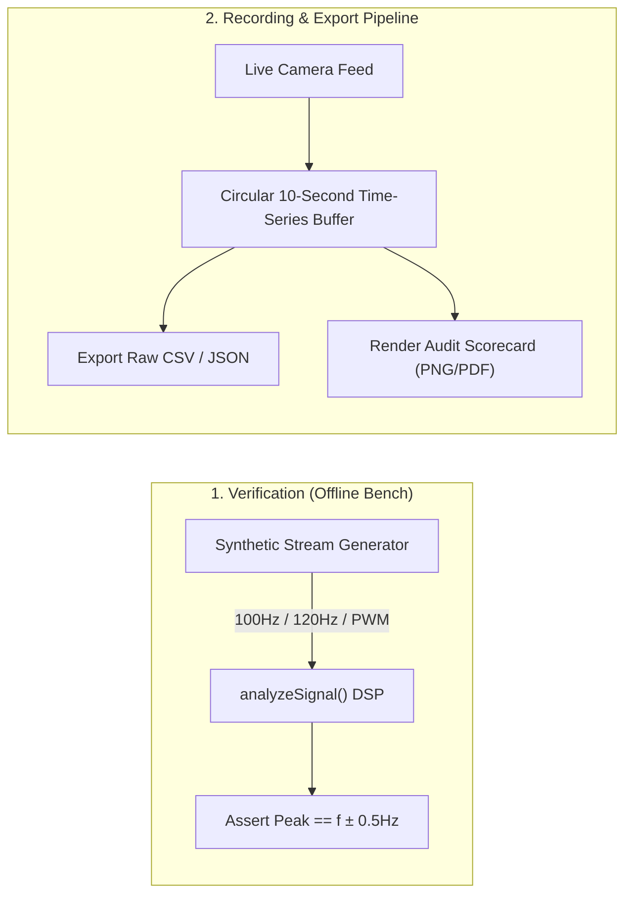

# Comprehensive System Review & Technical Feedback: FlickerHz

---

## 1. Multi-Perspective Review

```
                ┌─────────────────────────────────────────────────────────┐
                │                       FlickerHz                         │
                │        Light Bulb Frequency & Driver Analyzer           │
                └───────────────────────────┬─────────────────────────────┘
                                            │
         ┌──────────────────┬───────────────┴───────────────┬──────────────────┐
         ▼                  ▼                               ▼                  ▼
  [🧪 Testing/QA]    [📐 System Design]              [⚙️ Engineering]   [💼 Product/Biz]
  • No unit tests    • Monolithic app.js             • DSP & FFT (4096)  • High novelty
  • No synthetic test• Main-thread canvas stalls     • Sub-bin parabola  • SSL hurdle
  • Hardware-bound   • Zero DB / single localStorage • Anti-flicker clash• Export missing
```

### A. Testing & Quality Assurance Perspective
* **Current State**: Testing is currently **100% manual and hardware-dependent**. There are no automated unit tests, integration tests, or end-to-end regression suites.
* **The Hardware Bottleneck**: To test whether a code change breaks peak detection, a developer currently must hold a real physical phone in front of a real physical flickering bulb.
* **Missing Simulation Engine**: There is no synthetic video feed or mock `MediaStream` capable of injecting pure mathematical signals ($100\text{ Hz}$ sine, $120\text{ Hz}$ sine, $250\text{ Hz}$ square wave PWM, pure DC, white noise) into the analyzer.
* **Cross-Browser / Platform Fragmentation**: Camera behavior on Android differs drastically between Chrome (Blink), Samsung Internet, Firefox Mobile (Gecko), and WebView environments. Constraints like `facingMode: 'environment'` or resolution requests fail silently on certain hardware.

### B. System Design Perspective
* **Monolithic Architecture**: All frontend logic (~1,000 lines in `app.js`) couples UI rendering, camera lifecycle, DSP/FFT math, modal dialogs, and local storage into one global scope.
* **Thread Contention (UI vs. Compute)**: Image extraction (`getImageData`), Fourier analysis, and canvas rendering run synchronously on the browser's single UI thread inside `requestAnimationFrame`. On lower-end mobile devices, `getImageData` on a $512 \times 512$ canvas (~1 MB/frame at 60fps = 60 MB/sec bus transfer) can cause frame drops and UI sluggishness.
* **Data Persistence**: Only a single scalar `rolling_shutter_skew` is saved in `localStorage`. If the user switches between camera lenses (e.g., Ultra-Wide vs. 1x Main), the physical line rate changes, but the app has no multi-lens profiling memory.
* **Extensibility**: Lacks an IndexedDB data store to save sessions, test logs, waveform traces, or bulb audit reports.

### C. Engineering & DSP Perspective
* **Strengths**:
  * The Cooley-Tukey Radix-2 FFT with pre-computed trigonometric lookup tables and bit-reversal permutations is fast and numerically sound.
  * Parabolic sub-bin interpolation ($p_{\text{interp}} = p + d$) provides sub-hertz frequency resolution without requiring prohibitive FFT sizes.
  * Dual-axis auto-detection ($X$ vs $Y$) handles portrait/landscape orientations cleanly.
* **Vulnerabilities**:
  * **Garbage Collection (GC) Pressure**: While FFT lookup tables are pre-allocated, temporary `Float32Array` buffers (`colAverages`, `rowAverages`, `windowed`, `realBuffer`, `magnitudes`) are re-instantiated in `processFrameLoop` and `analyzeSignal` every single frame, triggering GC pauses on mobile devices.
  * **Camera Anti-Flicker Interference**: Most modern smartphone cameras have auto-exposure algorithms specifically tuned to *suppress* rolling-shutter bands (e.g., 50Hz/60Hz de-banding). If the camera firmware engages anti-banding, the bands vanish or oscillate unpredictably.
  * **Optical Exposure Integration (Motion Blur)**: Without manual shutter speed locking, a camera in auto mode will expose for 1/33s to 1/50s in indoor lighting. Integrating a $100\text{ Hz}$ wave over $20\text{ ms}$ averages out the peaks and troughs, falsely showing a $0\%$ modulation depth (making a dangerous, flickering bulb look "flicker-free").
  * **High-Frequency Attenuation**: Phosphor persistence in white phosphor LEDs acts as an analog low-pass filter, reducing high-frequency PWM visibility relative to bare RGB LEDs.

### D. Product & Engineering Management Perspective
* **Value Proposition**: The core proposition ("Turn your smartphone into a laboratory-grade flicker meter") is compelling and addresses a real need for health-conscious consumers, electricians, videographers, and workplace safety inspectors.
* **Critical Friction Point**: Requiring a local Node.js server with self-signed SSL certificates is an insurmountable barrier for non-technical users. For mass adoption, the PWA must be hosted on a public domain with a trusted CA (e.g., Cloudflare Pages, Vercel, GitHub Pages) so that `https://` and `getUserMedia` work with zero security warnings.
* **Actionable Utility**: Knowing a bulb is $100\text{ Hz}$ is interesting; knowing whether it will cause migraines or violates workplace standards is actionable. The IEEE 1789 classification is a strong start, but users need shareable proof (exportable cards/reports).

### E. Marketing & Commercialization Perspective
* **Target Personas**:
  1. *Health & Wellness*: People sensitive to invisible flicker (migraines, ADHD, eye strain).
  2. *Videographers & Content Creators*: Creators eliminating video banding/striping under indoor lighting.
  3. *Home Inspectors & Electricians*: Verifying compliance with Title 24, JA8, and IEEE 1789.
  4. *Tech Reviewers*: Benchmarking bulbs from Amazon, IKEA, Philips Hue, etc.
* **Viral Hook ("The Bulb Health Scorecard")**: Generate an easily shareable graphic card (Letter Grade: A+, B, F) showing "Eye Safety Rating," frequency, and modulation depth for social media or warranty claims.

---

## 2. Feature Status Matrix

| Feature | Status | Location | Notes & Gaps |
| :--- | :---: | :--- | :--- |
| **FFT Frequency Engine** | **Complete** | `app.js` | 4096-point Radix-2 Cooley-Tukey with sub-bin parabolic peak interpolation. |
| **Dual-Axis Detection** | **Complete** | `app.js` | Computes horizontal & vertical SNR; locks to higher-contrast axis. |
| **Driver Quality (IEEE 1789)** | **Complete** | `app.js` | Calculates % Flicker and checks Low-Risk and NOEL boundaries. |
| **Oscilloscope & FFT Spectrum** | **Complete** | `app.js` | Direct canvas rendering with peak marker overlays. |
| **Two-Step Calibration Wizard** | **Complete** | `app.js` | Calibrates sensor skew against 50Hz/60Hz AC reference. |
| **Offline PWA Support** | **Complete** | `sw.js`, `manifest.json` | Asset caching and standalone display mode. |
| **Camera Parameter Controls** | **Incomplete** | `app.js` | Does not request manual exposure, lock anti-banding, or disable auto-focus. |
| **Saturation & Clipping Warnings** | **Incomplete** | Missing | No warning when white clipping ($Y=255$) or under-exposure distorts % flicker. |
| **Multi-Lens Skew Profiling** | **Incomplete** | `app.js` | Only 1 global skew stored; switching between Wide/Ultrawide invalidates calibration. |
| **Half-Wave Rectified Detection** | **Incomplete** | `app.js` | 50Hz/60Hz fundamental flicker may be attenuated by the 18ms detrending window. |
| **Synthetic Signal Generator** | **Missing** | — | No offline mock stream to test DSP without a physical bulb. |
| **Data Logging & Recording** | **Missing** | — | Cannot record 5s–30s traces or export time-series data. |
| **Session Export (CSV / PDF / PNG)** | **Missing** | — | No exportable report or scorecard. |
| **Web Worker Offloading** | **Missing** | — | DSP and canvas extraction run on the main browser thread. |

---

## 3. What Needs Extra Testing?

```
┌──────────────────────────────────────────────────────────────────────────┐
│                           Critical Test Cases                            │
├──────────────────────┬───────────────────────────────────────────────────┤
│ Multi-Lens Switching │ Main (1x) vs Ultra-Wide (0.5x) have different skews│
├──────────────────────┼───────────────────────────────────────────────────┤
│ Waveform Harmonics   │ Square-wave PWM has strong 3rd/5th harmonics      │
├──────────────────────┼───────────────────────────────────────────────────┤
│ Exposure Attenuation │ Long exposure (1/30s) flattens % flicker to 0%    │
├──────────────────────┼───────────────────────────────────────────────────┤
│ Pixel Saturation     │ Saturated center (255) clips waveform peaks       │
├──────────────────────┼───────────────────────────────────────────────────┤
│ Orientation Shifts   │ 90° / 180° / 270° sensor mounting differences     │
└──────────────────────┴───────────────────────────────────────────────────┘
```

1. **Multi-Camera Arrays on Modern Phones**:
   * Modern devices have 3–4 rear lenses (Ultra-wide, Main, 3x Telephoto). Each lens uses a physically distinct sensor with a different rolling-shutter readout duration ($T_{\text{skew}}$).
   * *Test Requirement*: Switching cameras in the dropdown must load camera-specific calibration data.
2. **Sensor Rotation Across Manufacturers**:
   * Android devices mount camera sensors in landscape (sensor coordinate system) and rotate frames via HAL metadata. In portrait mode, some phones output transposed buffers where lines scan left-to-right rather than top-to-bottom.
   * *Test Requirement*: Verification on Samsung, Google Pixel, Xiaomi, and Motorola devices in both portrait and landscape.
3. **Square Wave vs. Sine Wave Harmonic Aliasing**:
   * AC ripple produces smooth sinusoids ($100\text{ Hz}$ or $120\text{ Hz}$). PWM dimming produces sharp square waves with significant 3rd, 5th, and 7th harmonics ($300\text{ Hz}, 500\text{ Hz}, 700\text{ Hz}$).
   * *Test Requirement*: Verify that the fundamental frequency is accurately selected even when harmonic peaks are elevated.
4. **Saturation & Flat-Topping**:
   * Pointing directly at a bare high-lumen LED bulb often clips sensor pixel values at 255. A clipped sine wave becomes a pseudo-square wave, distorting the calculated Percent Flicker and generating artificial odd harmonics.
   * *Test Requirement*: Test performance under extreme luminance contrast and verify clipping alert triggers.

---

## 4. Light Source Physics & Verification Challenges

### A. Ambient Light DC Dilution
* **The Physics**: If an AC bulb with $100\%$ modulation depth is measured in a brightly sunlit room, the constant DC sunlight adds a baseline offset to $L_{\text{min}}$ and $L_{\text{max}}$.
* **The Impact**: 
  $$\text{Percent Flicker} = \frac{L_{\text{max}} - L_{\text{min}}}{L_{\text{max}} + L_{\text{min}}} \times 100\%$$
  The added ambient DC increases the denominator, artificially making a poor-quality driver appear "compliant" with low-risk standards.
* **Mitigation**: The app should instruct the user to take a dark/ambient baseline or measure in shielded conditions.

### B. Single-Diode Half-Wave Rectification (50Hz / 60Hz Fundamental)
* **The Physics**: Ultra-cheap LED strings or defective bulb drivers sometimes use a single diode rather than a full-wave bridge rectifier. These flicker at **$50\text{ Hz}$ or $60\text{ Hz}$** (fundamental mains frequency), not $100\text{ Hz} / 120\text{ Hz}$.
* **Current Vulnerability**: The sliding-window detrend filter uses $W \approx 15\text{ ms}$, which has a high-pass cutoff around $33\text{ Hz}$–$66\text{ Hz}$. This can partially attenuate a $50\text{ Hz}$ fundamental wave.
* **Mitigation**: Adjust the detrend window to at least $25\text{ ms}$–$30\text{ ms}$ to preserve $50\text{ Hz}$ signals.

### C. Triac / Phase-Cut Dimmer Artifacts
* **The Physics**: Traditional wall dimmers chop the AC phase angle (leading or trailing edge). The resulting light waveform features sharp voltage transients and asymmetrical half-cycles.
* **The Impact**: Causes ringing in the FFT spectrum across multiple adjacent bins.

### D. Phosphor Decay Time Constants
* **The Physics**: Most white LEDs use a blue InGaN emitter coated with a yellow Ce:YAG phosphor. While the semiconductor responds in nanoseconds, yellow phosphor has an exponential decay persistence of $1\text{ ms}$ to $2\text{ ms}$.
* **The Impact**: Above $1\text{ kHz}$, the phosphor smooths out PWM switching naturally, acting as a physical low-pass filter.

---

## 5. Camera & Environmental Initialization Strategy

```
┌─────────────────────────────────────────────────────────────────────────────┐
│                    Advanced Camera Initialization Pipeline                  │
└──────────────────────────────────────┬──────────────────────────────────────┘
                                       │
         ┌─────────────────────────────┼─────────────────────────────┐
         ▼                             ▼                             ▼
 [1. Anti-Banding Override]    [2. Sensor Saturation HUD]   [3. Lens Calibration Memory]
 • Query track capabilities    • Inspect ROI histograms     • Store skew keyed by:
 • Disable 50Hz/60Hz notch     • Alert on White Clip (255)    deviceId + resolution
 • Request min exposureTime    • Alert on Underexposure (<20) • Re-load on camera change
```

### 1. Programmatic Anti-Banding & Exposure Overrides
In modern Android Chrome, `MediaStreamTrack.applyConstraints()` can configure advanced camera parameters if exposed by the HAL:

```javascript
async function configureOptimalCapture(track) {
  const capabilities = track.getCapabilities ? track.getCapabilities() : {};
  const advancedConstraints = {};

  // 1. Disable camera anti-flicker / anti-banding if supported
  if (capabilities.exposureMode && capabilities.exposureMode.includes('manual')) {
    advancedConstraints.exposureMode = 'manual';
  }

  // 2. Request minimum exposure time to freeze rolling bands (target < 1ms)
  if (capabilities.exposureTime) {
    advancedConstraints.exposureTime = capabilities.exposureTime.min || 1;
  }

  // 3. Lock continuous focus to avoid focus hunting on high-contrast stripes
  if (capabilities.focusMode && capabilities.focusMode.includes('continuous')) {
    advancedConstraints.focusMode = 'continuous';
  }

  if (Object.keys(advancedConstraints).length > 0) {
    try {
      await track.applyConstraints({ advanced: [advancedConstraints] });
      console.log('Applied advanced camera constraints:', advancedConstraints);
    } catch (err) {
      console.warn('Advanced camera constraints rejected by HAL:', err);
    }
  }
}
```

### 2. Live Exposure & Saturation Warning HUD
Add real-time pixel validation to alert the user before calculating metrics:
* **Over-exposure (Clipping)**: If $> 10\%$ of pixels in the central region have luminance $= 255$, display:
  `⚠️ EXPOSURE OVERFLOW: Bulb too bright. Step back 15–30cm.`
* **Under-exposure**: If average central luminance is $< 25$, display:
  `⚠️ SIGNAL TOO DARK: Move closer to the bulb.`

### 3. Per-Lens Skew Persistence
Update skew storage to key by camera device ID and resolution:
```javascript
const storageKey = `skew_${currentDeviceId}_${videoWidth}x${videoHeight}`;
const savedSkew = localStorage.getItem(storageKey) || localStorage.getItem('rolling_shutter_skew') || 0.030;
```

---

## 6. Output Verification & Recording Architecture



### A. Synthetic Bench Test Generator (Self-Verification)
A built-in test generator that renders a synthetic rolling-shutter pattern to an offscreen canvas and feeds it into the analysis pipeline via `canvas.captureStream()`. This verifies:
* FFT accuracy at $100\text{ Hz}$, $120\text{ Hz}$, $250\text{ Hz}$, and $1000\text{ Hz}$.
* Detrending and parabolic peak interpolation accuracy.
* IEEE 1789 boundary calculations without physical hardware.

```javascript
// Verification Generator Example
function generateSyntheticFlickerFrame(canvas, targetHz, percentFlicker, skewSec) {
  const ctx = canvas.getContext('2d');
  const w = canvas.width, h = canvas.height;
  const imgData = ctx.createImageData(w, h);
  const data = imgData.data;

  const baseline = 128;
  const amplitude = baseline * (percentFlicker / 100);

  for (let y = 0; y < h; y++) {
    // Time at this scanline
    const t = (y / h) * skewSec;
    const lum = Math.min(255, Math.max(0, baseline + amplitude * Math.sin(2 * Math.PI * targetHz * t)));

    for (let x = 0; x < w; x++) {
      const idx = (y * w + x) * 4;
      data[idx] = lum;
      data[idx + 1] = lum;
      data[idx + 2] = lum;
      data[idx + 3] = 255;
    }
  }
  ctx.putImageData(imgData, 0, 0);
}
```

### B. Time-Series Buffer & Session Recording
1. **10-Second Rolling Circular Buffer**: Store `timestamp`, `freq`, `percentFlicker`, `snr`, and downsampled raw waveform snapshots at 30fps (300 data points).
2. **CSV / JSON Data Export**:
   * Allows engineers and lighting technicians to download time-stamped frequency, modulation depth, and raw scanline waveform data for verification in MATLAB, Python, or Excel.
3. **Downloadable Inspection Report Card**:
   * Uses an offscreen HTML5 canvas to compose a shareable certificate:
     * **Bulb Health Grade**: `A` (Flicker-free), `B` (Low-risk), `F` (Severe AC Ripple / Seizure Hazard).
     * **Measured Metrics**: Frequency ($\text{Hz}$), Modulation Depth ($\%$), IEEE 1789 Risk Category.
     * **Visual Proof**: Embedded waveform snippet and FFT peak chart.
     * **Metadata**: Date, device model, camera lens ID, sensor line rate.

---

## 7. Recommended Implementation Phases

```
Phase 1: Robustness & Initialization (Immediate)
├── Add pixel saturation & underexposure detection HUD
├── Implement MediaTrack advanced constraint negotiation (manual exposure, anti-banding)
└── Pre-allocate typed arrays in processing loop to eliminate GC pauses

Phase 2: Verification & Testing (Next Sprint)
├── Implement Synthetic Signal Generator for self-test mode
└── Multi-camera lens skew persistence in localStorage

Phase 3: Recording & Commercialization (Release v1.2.0)
├── 10-second capture & CSV/JSON export
├── Shareable "Bulb Health Report Card" (PNG generator)
└── Deploy to hosted HTTPS production domain (Cloudflare/Vercel)
```
